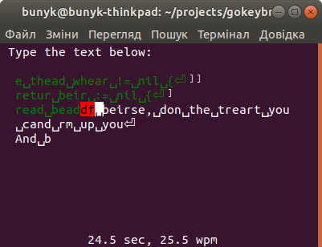

# Gokeybr
is a minimalistic touch-typing training program, that tries to improve on [keybr.com](https://www.keybr.com/) by generating training lessons not only from words, but with symbols from code, or any other type of text you would like to practice with. It is probably better suited for users that have already learned positions of the keys, know how to touch type, and now want to improve their typing speed.

You could, for example, train to type ten `if err != nil { return err }` per minute and become a faster Go coder.



On the screenshot you see `gokeybr` running in `random` mode, where it generates a training session based on your typing stats. In this case, it mixes code with "words", based on frequency and typing speed of character sequences in texts that have been used for other training sessions.

This program intentionally ignores stats on errors, instead, tracking the time needed to successfully type any text. But you are required to correct errors before making further progress in the exercise. So when you need to type "the", and you type "tje[backspace][backspace]he", the result will be the same, but you will probably need more time to type all those wrong, hit backspaces, and type it correctly. So errors will influence stats and increase the measure of necessity to practice typing "the".

The more often some sequence of keys appears in the text, the greater will be the need to type it faster. But the closer you get to the "speed of light" of 150 wpm, the harder it will be for you to improve, so training sessions are generated by taking those two aspects into account. `random` and `weakest` mode generate sessions with most frequent but slow to type character sequences. After some sequence will reach a speed of 150 wpm, it is unlikely to appear in training texts.

## Installation
```bash
go get github.com/bunyk/gokeybr
```

## Usage
Run `gokeybr`, type the text on the screen, hit `Esc` when you want to interrupt training sessions and that's it.

`gokeybr --help` will give you the latest and most accurate information with which parameters gokeybr could be started. Here is a sample of ways use it:

- `gokeybr text some_text.txt` - practice typing text. `-o` allows you to change the line from which to start, default 0, or the line where you left off.
- `gokeybr words` - practice typing words from a dictionary. Dictionary is a text file with one word per line. By default it uses system dictionary, but you can also choose your own.
- `fortune | gokeybr text -` - type random quote, just like on typeracer, but unfortunately without competition.
- `gokeybr random` - random text similar to keybr.com, based on your stats. If you have trained on some code - you will get curly brackets, etc.
- `gokeybr weakest` - practice what needs to be practiced the most to make your better typist.
- `gokeybr stats` - shows a short report of what gokeybr knows about you.


## How to improve your typing speed
This software will help you to apply so-called "deliberate practice" to touch typing. It is best described in the article
[The Making of an Expert](https://hbr.org/2007/07/the-making-of-an-expert), by the researcher Karl Ericsson.

People get better with practice, but not any kind of practice. Just typing daily will not improve your typing speed, as daily walking would not improve your running speed. This is because you do things you already know how to do. As golf champion Sam Snead once put it: "It is only human nature to want to practice what you can already do well, since it's a hell of a lot less work and a hell of a lot more fun."
 
Deliberate practice is different; it is a practice that focuses on tasks beyond your current level of competence and comfort. You need to do something that you can't do well.

`gokeybr` monitors your weakest key sequences and allows you to practice them when started with `gokeybr weakest`. 

## Alternative programs
- [typeracer](https://play.typeracer.com/) - web app where you race against others by typing quotes from books or movies.
- [keybr.com](https://www.keybr.com/) - web app that gives you random "words" to type, gathers some stats, and tunes exercises to better improve your progress.
- [typelit.io](https://www.typelit.io/) - web app that allows you to practice by typing good classic novels. So you could combine the fun of reading with the practice of typing. Also, you will practice typing texts by the best authors, which should improve your language too. (This kind of practice could be done with `gokeybr` too - just save your favorite novel in a text file, and run `gokeybr text novel.txt`. `gokeybr` will save the last line you typed, so in each session you can continue from where you left off.)
- [gotypist](https://github.com/pb-/gotypist) - app that inspired this one, where you type texts line by line, each line three times - slow (minimizing errors), fast (ignoring errors, maximizing speed), and normal (trying to be fast and not make errors at the same time).


## Code
A fork of [gotypist](https://github.com/pb-/gotypist), rewritten to use [tcell](https://github.com/gdamore/tcell/) instead of [termbox-go](https://github.com/nsf/termbox-go). Also added support for multiline typing sessions and statistically generated exercises. Removed modes, so in each session you could strive for any result you wish.

Acrhitecture is changed from Elm-like to more classical. Code is split in following packages:

- `cmd/` - is entry point of the program, handles parsing of arguments and starts app
- `app/` - contains code of event loop and overall logic of typing session
- `phrase/` - loading and generation of training texts
- `view/` - anything related to displaying information on the screen
- `stats/` - keeping track of your progress & helping to generate most useful training session
- `fs/` - utilities to work with filesystem storage
